# Lab 2: Build a serverless REST API with Monitoring


## 1. Overview and Objectives

This lab guides you through building a serverless REST API to cosume data from a DynamoDB to get product inventory. You'll start by manually creating the infrastructure in the AWS Console to understand each component.

**Team Structure:**
- Work in teams of 2

**Learning Objectives:**
- Continue gaining hands-on understanding of AWS
- Understand API gateway fundamental
- Configure a serverless and secure Lambda function
- Create a DynamoDB table
- Understand WAF basic configuration
- Set up automated notifications with SNS

## 2. Prerequisites

Before starting this lab, ensure you have the following installed and configured:

- **AWS Academy Learner Lab access**: Accept the invitation to AWS Academy and read `Academy Learner Lab Student Guide` (pages 3-7) and watch the video `Demo - How to Access Learner Lab`

## 3. Introduction


**Manual Configuration**: You will manually configure AWS resources through the AWS Console to understand the underlying concepts.


The architecture diagram below shows the final API layout used in this lab:

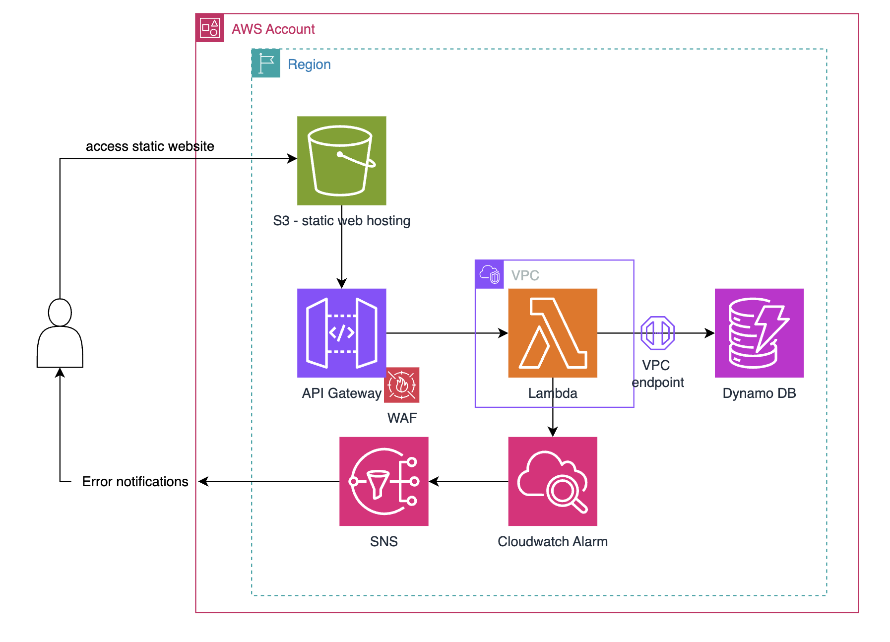

- **Frontend**: Static website hosted on S3
- **Security**: WAF (Web Application Firewall) for API protection
- **Network**: VPC with private subnets for Lambda
- **API Layer**: API Gateway REST API
- **Compute**: Lambda function (Python) in VPC
- **Database**: DynamoDB (accessed via VPC endpoint)
- **Monitoring**: CloudWatch (metrics, logs, alarms)
- **Notifications**: SNS for alerts and notifications

## 4. Accessing Your AWS Account

For this course, we use **AWS Academy Learner Lab** to provide access to real AWS accounts. These accounts have some limitations on available services and IAM roles to control costs, but include everything needed for this lab.

To access your AWS environment:

1. Go to **Modules** in your AWS Academy course and open **Launch AWS Academy Learner Lab**.
2. Click **Start Lab** to initialize your AWS session (the indicator will turn green when ready).
3. Click **AWS** to open the AWS Management Console in a new tab.

Make sure to keep an eye on remaining budget ($50), and avoid pressing the `Reset` button as you will lose all progress!

## Part 1: Manual Configuration


### 1: Create DynamoDB Table

DynamoDB serves as the data store for your REST API, providing fast, scalable NoSQL storage for product information that your Lambda function queries.

1. Navigate to **DynamoDB Console**
2. Click **Create table**

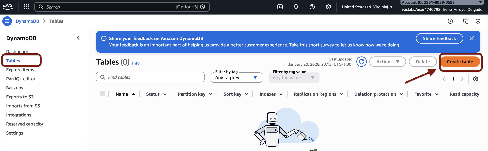

3. Configure:
   - **Table name**: `ProductInventory`
   - **Partition key**: `productId` (String)
   - **Table settings**: Use default settings (On-demand capacity)
4. Click **Create table**
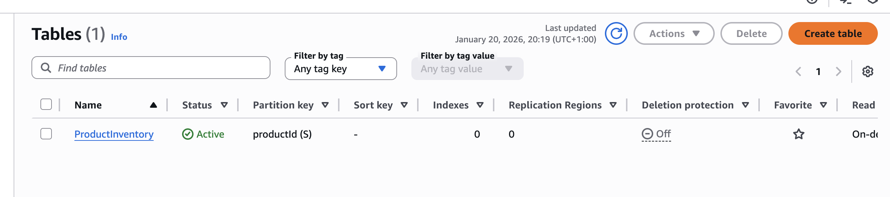


### 2: Add Sample Data

1. Open the `ProductInventory` table
2. Click **Explore table items** → **Create item**

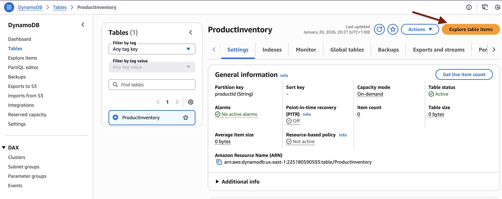

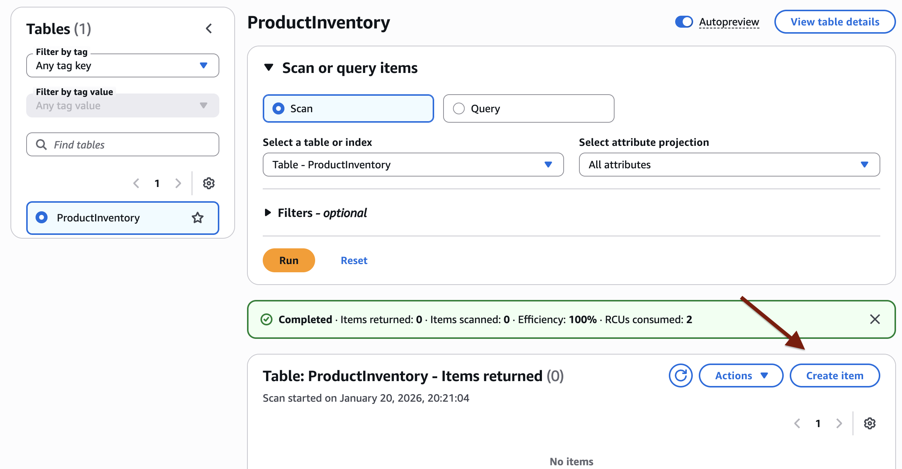
3. Add these sample products from `initial_data/sample-data.json' (create 5-10 items): 
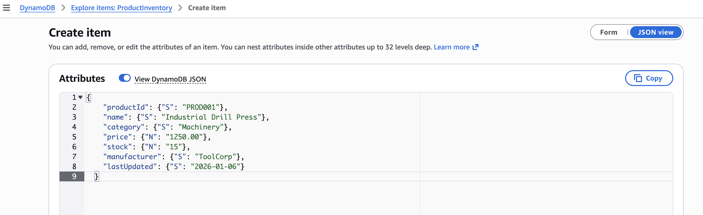

```json
{
    "productId": {"S": "PROD001"},
    "name": {"S": "Industrial Drill Press"},
    "category": {"S": "Machinery"},
    "price": {"N": "1250.00"},
    "stock": {"N": "15"},
    "manufacturer": {"S": "ToolCorp"},
    "lastUpdated": {"S": "2026-01-06"}
  }
```
4. You can test to Query the data with different filters in Explore items


### Step 3: Create VPC and Subnets

**Why VPC?** Placing Lambda in a VPC provides network isolation and allows private communication with AWS services.

1. Navigate to **VPC Console**
2. Click **Create VPC**
3. Configure:

In the creation form, provide the basic settings for this lab. Typical values used in the lab are:

  - **Name tag**: Choose a name as `ProductInventory`
  - **IPv4 CIDR block**: Choose a /24 CIDR, and ensure this does not overlap with your partner's VPC!
  - **IPv6 CIDR block**: None (IPv6 adoption is growing, but IPv4 is still the main system.)
  - **Tenancy**: Default (only customers that have strict physical isolation requirements change this)
  - **Number of AZs**: 1 (note that typically for high availability you would choose at least 2)
  - **Number of Public Subnets**: 1 (will be used for a Lambda with public IPs)
  - **Number of Private Subnets**: 0 (for this lab we won't be using them. However, for security reasons Lambda would typically go in private subnets.)
  - **NAT GWs**:  None (we'll use VPC endpoints instead for accesing DynamoDB table)

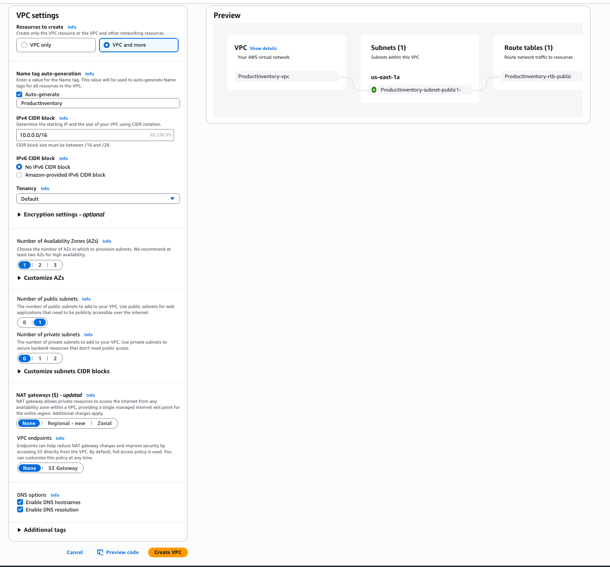


4. Click **Create VPC**

**Note the following IDs** (you'll need them later):
- VPC ID
- Private Subnet IDs (1 subnets)
- Security Group ID (default)

### Step 4: Create VPC Endpoint for DynamoDB

**Why VPC Endpoint?** Allows Lambda to access DynamoDB without needing internet access or NAT Gateway (saves cost).

1. In **VPC Console**, go to **Endpoints**
2. Click **Create endpoint**

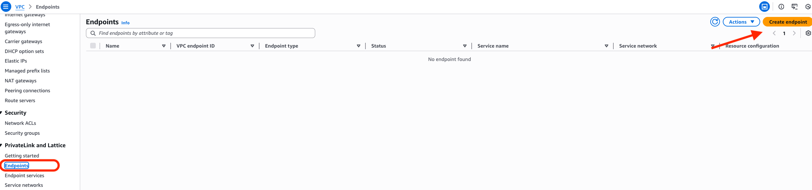

3. Configure:
   - **Name**: `ProductInventory-DynamoDB-Endpoint`
   - **Service category**: AWS services
   - **Service name**: Search for `dynamodb` → Select `com.amazonaws.[region].dynamodb` (Gateway type)
   - **VPC**: Select `ProductInventory-VPC`
   - **Route tables**: Select all route tables associated with your private subnets
   - **Policy**: Full access
4. Click **Create endpoint**

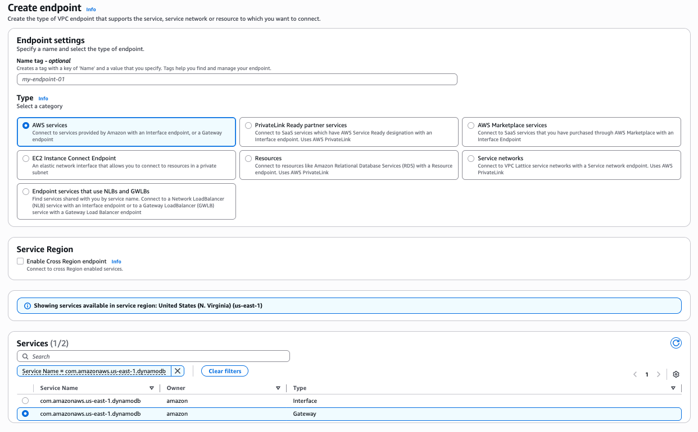

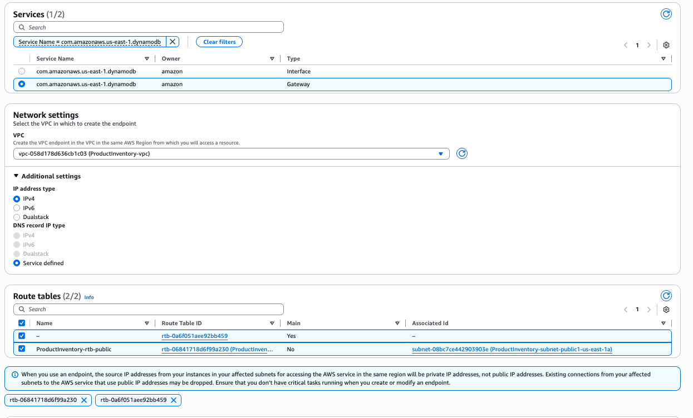

### Step 5: Create Lambda Function

Lambda funcion execute serverless code to query the DynamoDB table and returns product data based on search filters like category, name, and price range.

1. Navigate to **Lambda Console**
2. Click **Create function**
3. Configure:
   - **Function name**: `ProductSearchFunction`
   - **Runtime**: Python 3.14
   - **Architecture**: x86_64
   - **Change default execution rol**: Use a existing Role -> LabRole
   - **Advanced settings** → Expand
   - **Enable VPC**: ✓ (checked)
   - **VPC**: Select `ProductInventory-VPC`
   - **Subnets**: Select the previous subnet created
   - **Security groups**: Select `default`
4. Click **Create function**

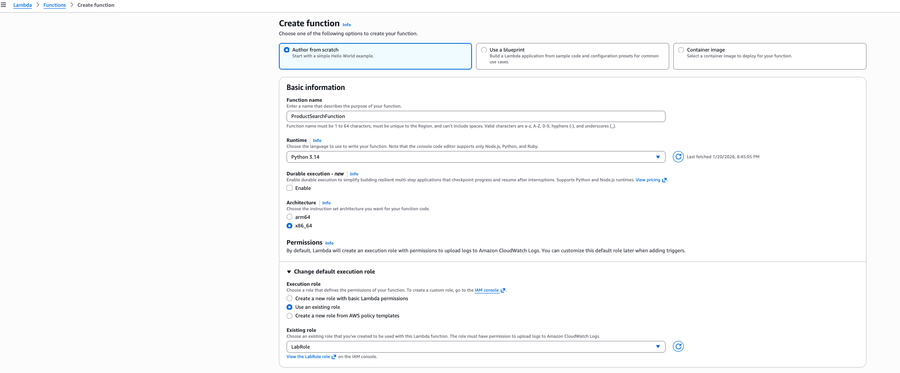

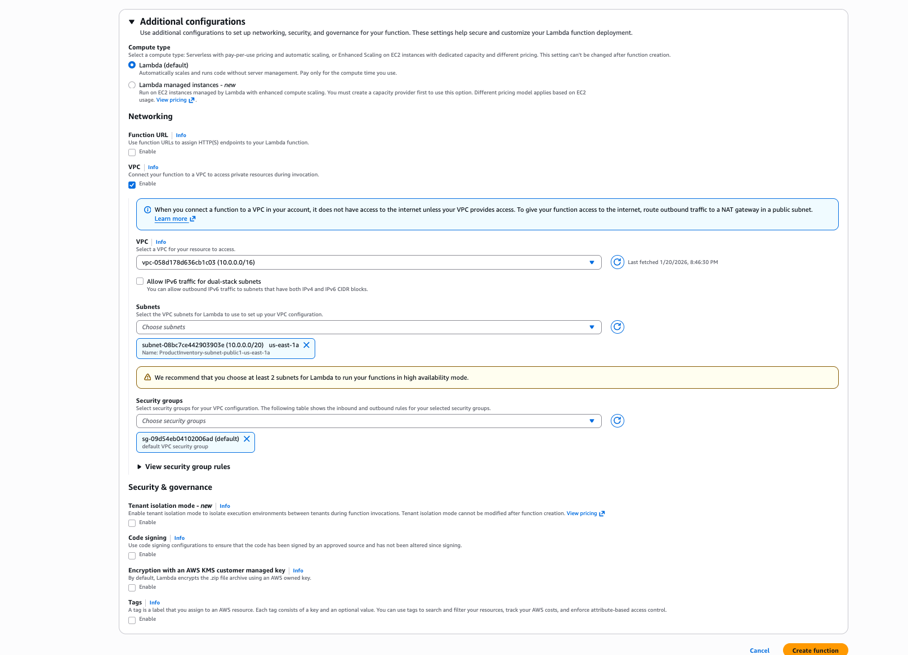

6. Replace the function code with from 'initial_data/lambda_function.py' and press "deploy"

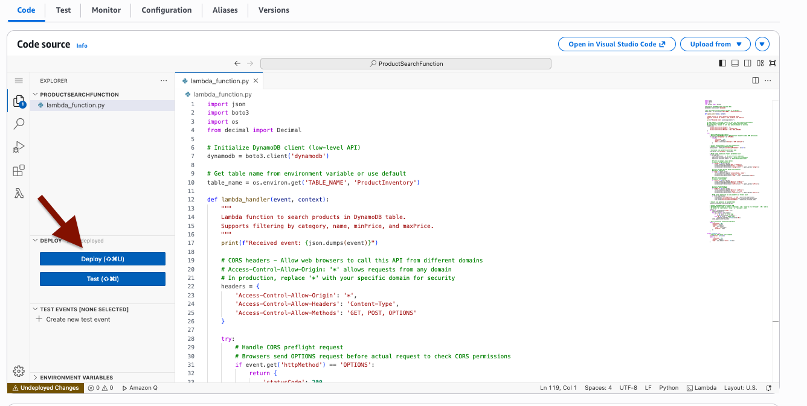

7. Once it is deployed, press 'Test' to test that the lambda can query the data from DynamoDB

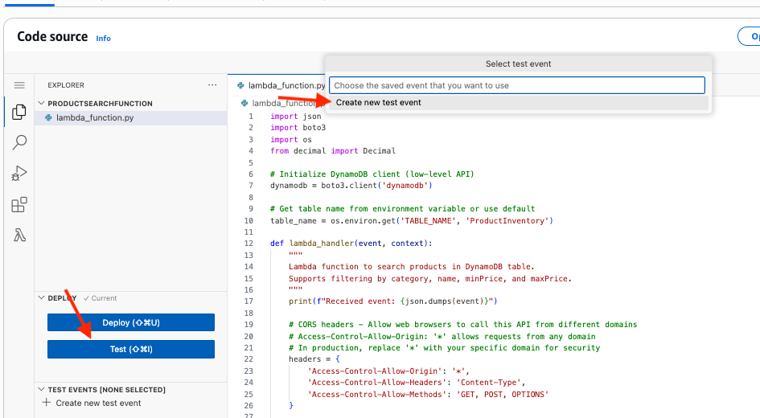

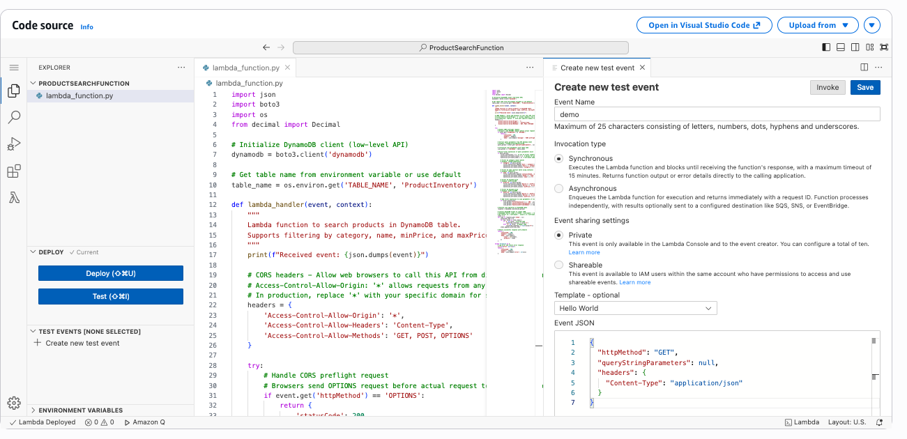

Test 1: Get All Products (without filters)
```json
{
  "httpMethod": "GET",
  "queryStringParameters": null,
  "headers": {
    "Content-Type": "application/json"
  }
}
```

Test 2: Filter by Category

```json
{
  "httpMethod": "GET",
  "queryStringParameters": {
    "category": "Machinery"
  },
  "headers": {
    "Content-Type": "application/json"
  }
}
```

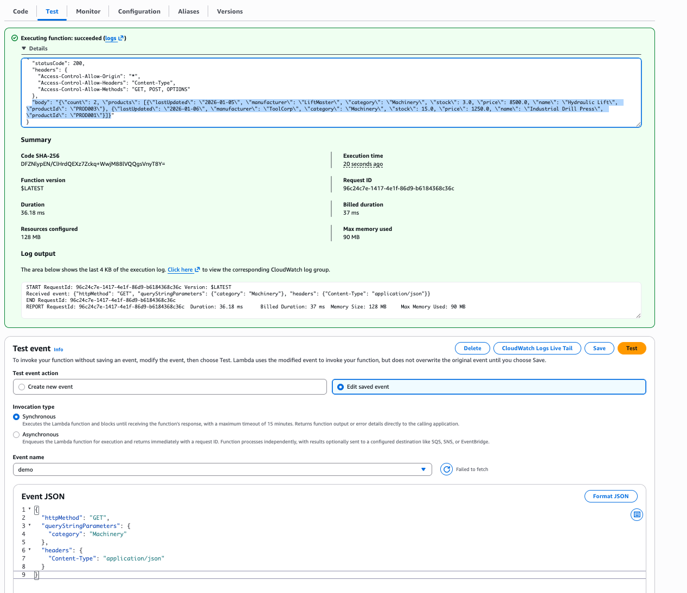


### Step 6: Create API Gateway to invoke via API the Lambda function created

This step creates the API Gateway that serves as the front door for your serverless backend. You create a REST API named ProductInventoryAPI with a Regional endpoint type. API Gateway acts as the HTTP interface that allows external clients (like your S3-hosted website) to invoke your Lambda function

1. Navigate to **API Gateway Console**
2. Click **Create API**
3. Choose **REST API** (not private) → **Build**
4. Configure:
   - **API name**: `ProductInventoryAPI`
   - **Endpoint Type**: Regional
5. Click **Create API**

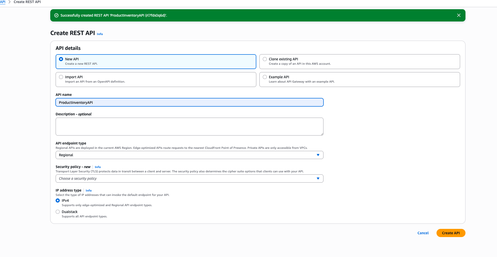

### Step 7: Configure API Resources and Methods

This step sets up the actual API structure and connects it to your Lambda function

1. Click **Actions** → **Create Resource**
   - **Resource Name**: `products`
   - **Resource Path**: `/products`
   - Enable **CORS**, 
   CORS (Cross-Origin Resource Sharing) is a security mechanism that allows a web page from one domain to request resources from a different domain. For the lab CORS works by having the server (API Gateway) send special HTTP headers like Access-Control-Allow-Origin: * that tell the browser it's safe to allow the cross-origin request. Without these headers, the browser will block the API call and show a CORS error in the console.
2. Click **Create Resource**

You create a /products resource path with CORS enabled (Cross-Origin Resource Sharing allows your S3 website to call the API from a different domain)


3. Select `/products` resource → **Actions** → **Create Method** → **GET**

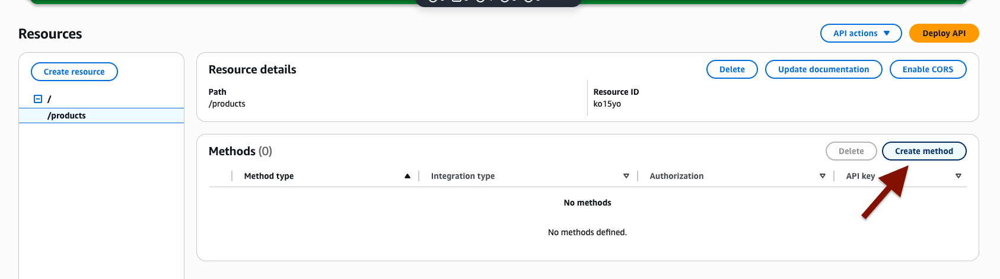

4. Configure GET method:

You add a GET method to the /products resource and configure it to use Lambda Proxy integration, which forwards the entire HTTP request to your ProductSearchFunction Lambda

   - **Integration type**: Lambda Function
   - **Lambda Function**: `ProductSearchFunction`
   - **Use Lambda Proxy integration**: ✓ (checked)
5. Click **Save** → **OK** (to grant permissions)

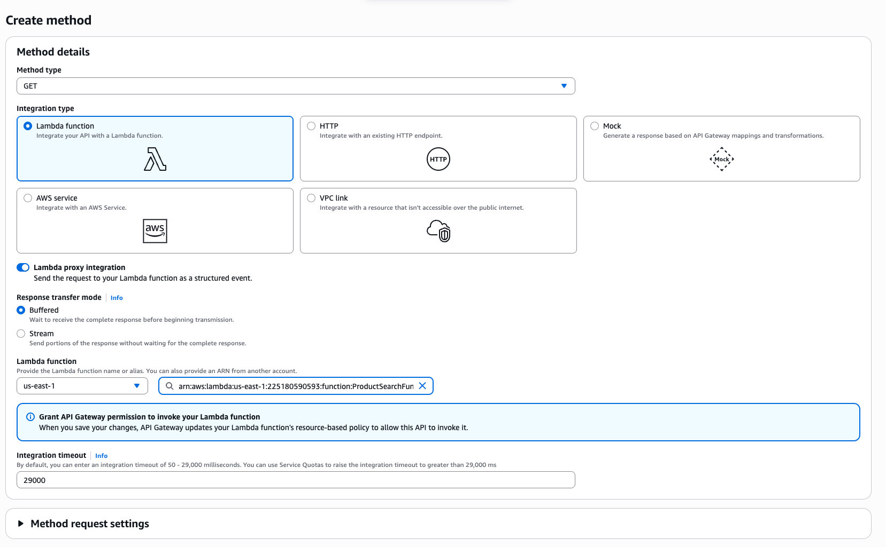


6. Enable CORS:

You enable CORS on the resource, which adds the necessary headers (Access-Control-Allow-Origin: *, etc.) so browsers don't block requests from your static website to the API

  - Select `/products` → **Enable CORS**
  - **Gateway responses**: Keep both checkboxes selected (Default 4XX and Default 5XX)
    - This ensures error responses also include CORS headers
  - **Access-Control-Allow-Methods**: Keep **GET** checked
  - **Access-Control-Allow-Headers**: Keep the default headers
  - **Access-Control-Allow-Origin**: Keep `*` (allows all domains)
  - Click **Save**

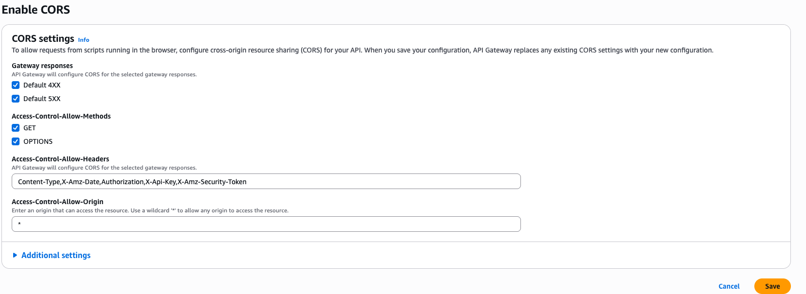

### Step 8: Deploy API

Deploy the API to expose your Lambda function as a callable REST endpoint at a URL like https://abc123.execute-api.us-east-1.amazonaws.com/prod/products.

1. Click **Actions** → **Deploy API**
2. Configure:
   - **Deployment stage**: [New Stage]
   - **Stage name**: `prod`
3. Click **Deploy**
4. **Copy the Invoke URL** (e.g., `https://abc123.execute-api.us-east-1.amazonaws.com/prod`) then you need to add the path /products to the url to access the methods

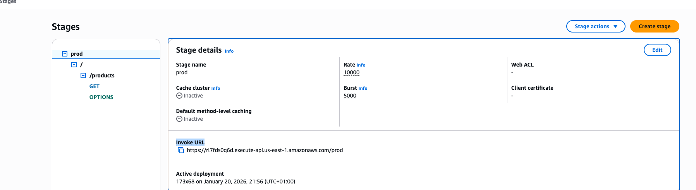

#### Test Your API

**Option 1: Test with curl**
```bash
curl "https://YOUR-INVOKE-URL/prod/products?category=Machinery"
```
Expected response: JSON with products in "Machinery" category

**Option 2: Test in API Gateway Console**
1. In API Gateway, select your API → **Resources**
2. Click on the **GET** method under `/products`
3. Click **Test** button (lightning bolt icon)
4. In **Query Strings**, add: `category=Tools`
5. Click **Test**
6. You should see a 200 response with product data in the response body

### Step 9: Create S3 Bucket for hosting the Static Website

This step creates an S3 bucket that will host your frontend web application. 

1. Navigate to **S3 Console**
2. Click **Create bucket**
3. Configure:
   - **Bucket name**: `product-inventory-web-us-east-1-[your-initials-random]` (must be globally unique)
   - **Region**: Same as your other resources
   - **Uncheck** "Block all public access"
    Tou can check the options
□ Block public access granted through new ACLs (opcional)
□ Block public access granted through any ACLs (opcional)

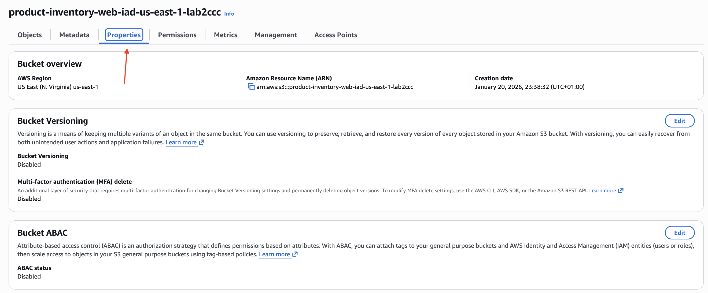

   - Acknowledge the warning

4. Click **Create bucket**
5. Once created, go to Permissions from the new bucket created and add the following Bucket policy to enable to access to the website you are going to host

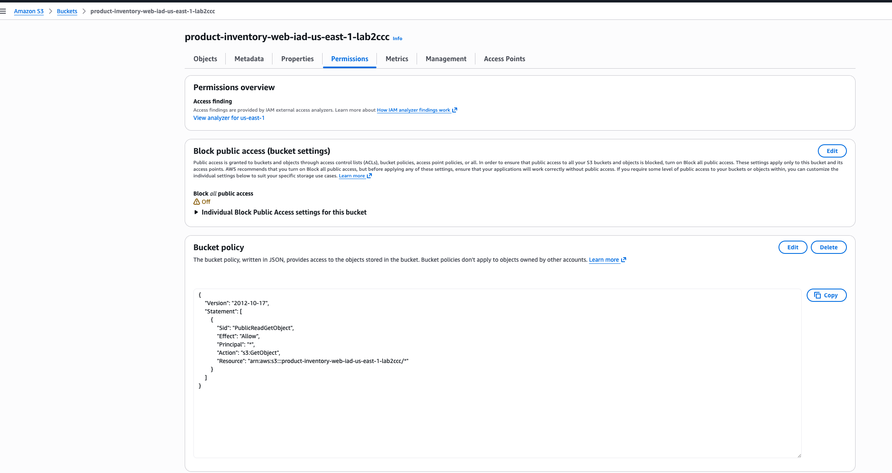
IMPORTANT: Replace s3 bucket name in YOUR-BUCKET-NAME

```json
{
    "Version": "2012-10-17",
    "Statement": [
        {
            "Sid": "PublicReadGetObject",
            "Effect": "Allow",
            "Principal": "*",
            "Action": "s3:GetObject",
            "Resource": "arn:aws:s3:::YOUR-BUCKET-NAME/*"
        }
    ]
}
```


### Step 10: Enable Static Website Hosting

1. Open your bucket → **Properties** tab

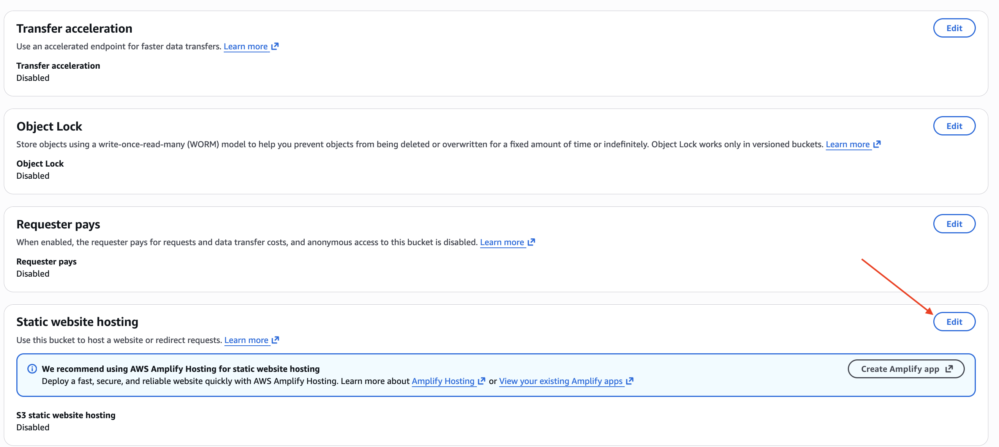
2. Scroll to **Static website hosting** → **Edit**
3. Configure:
   - **Static website hosting**: Enable
   - **Hosting type**: Host a static website
   - **Index document**: `index.html`
4. Click **Save changes**

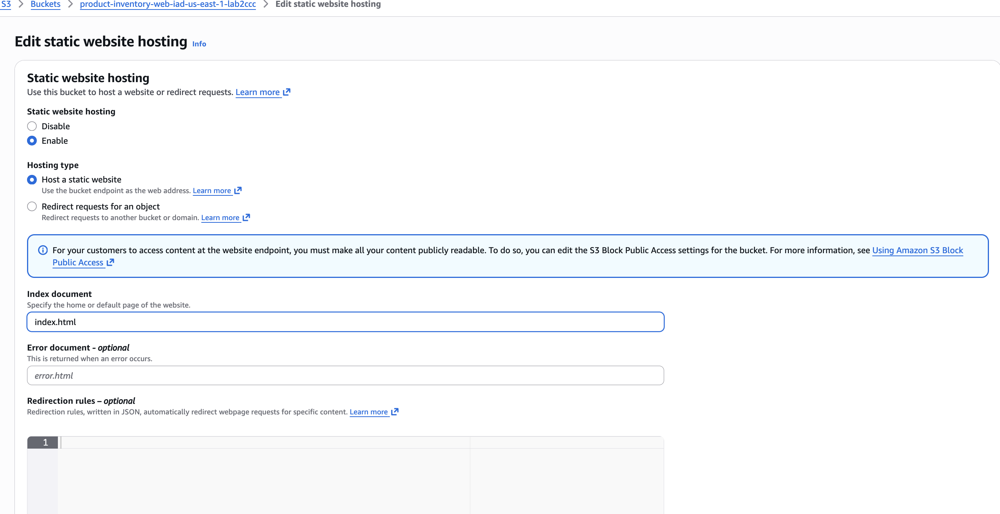

5. **Copy the Bucket website endpoint URL, you need it to access the page later**


### Step 11: Create and Upload Static Website

Create `index.html` with the content from 'initial_data/index.html' content (IMPORTANT: replace `YOUR-API-GATEWAY-URL`with the Invoke URL from API gateway adding the name of the path you added e.g. `https://abc123.execute-api.us-east-1.amazonaws.com/prod/products`):

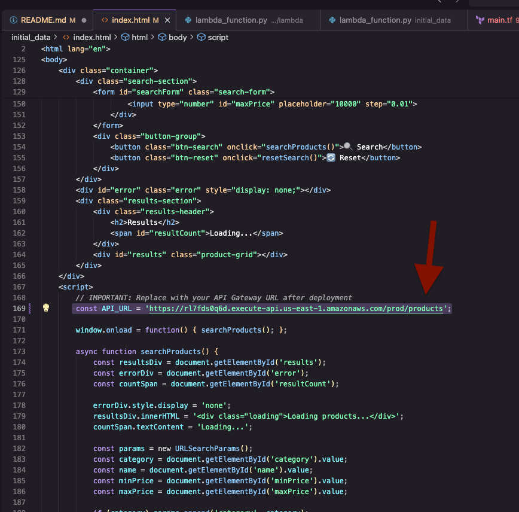

Upload to S3:
1. Go to your S3 bucket → **Objects** tab
2. Click **Upload** → **Add files**
3. Select `index.html`
4. Click **Upload**

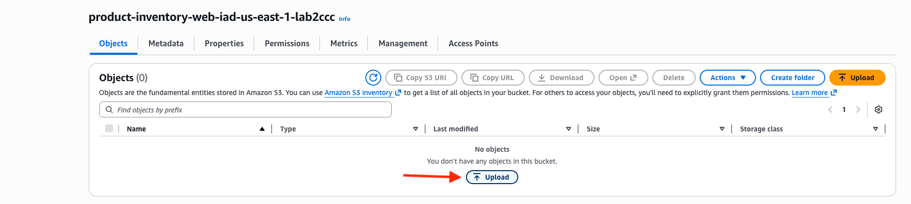


### Step 12: Create WAF Web ACL to protect the API

This step adds a security layer in front of your API Gateway using AWS WAF (Web Application Firewall). 


1. Navigate to **WAF & Shield Console**
2. Click **Web ACLs** → **Create web ACL**
3. Select **App category** -> API & integration services
4. Select resources to protect -> Add Resources -> Add regional resources (you will see some errors for access denied, but you can proceed)
5. Select you API gateway previously created to protect
6. Select the recommended plan for you with all the protection and click `Create  protection pack (web ACL)`.
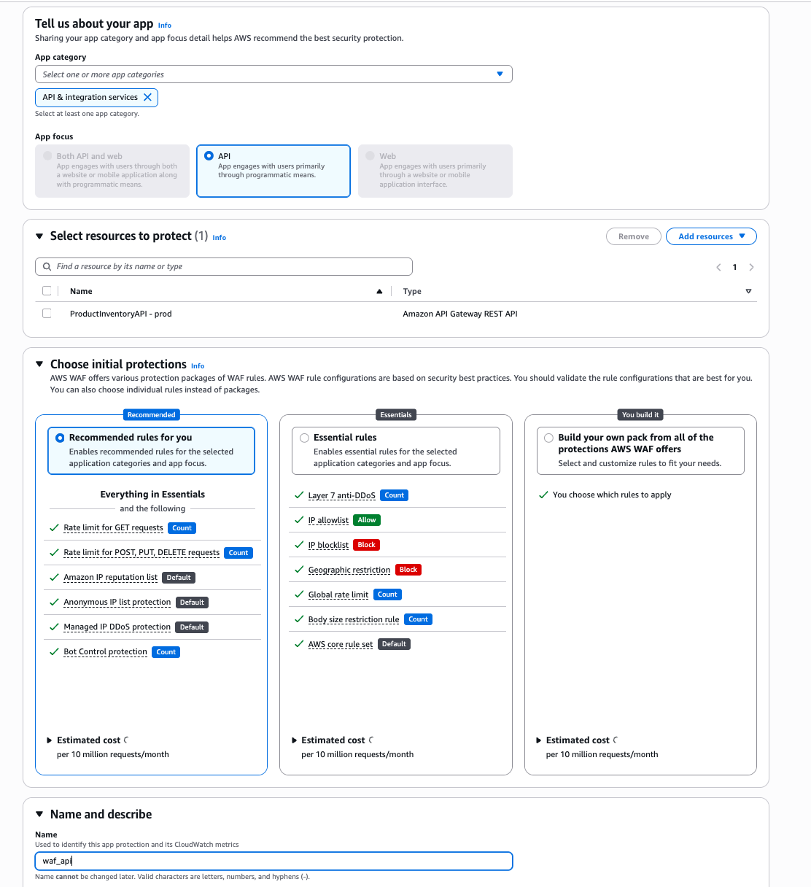

7. In the created WAF, click on Rules to understand what is enabled
With recommended plan (step 6), AWS automatically enables a set of managed rule groups based on the "API & integration services" category, providing baseline protection against common threats.

Adding custom rules from the following step, you can enhance this protection by manually adding or customizing specific rule groups like Core rule set, Known bad inputs, and SQL database rules to tailor the security to your API's specific needs.
8. Add a new rule, 
    -  Click **Add rules** → **Add managed rule groups**
    - Expand **AWS managed rule groups**
    - Enable these rule groups:
    - ✓ **Known bad inputs** (blocks malicious patterns)
    - ✓ **SQL database** (SQL injection protection)

**Note**: WAF will now protect your API from common attacks.

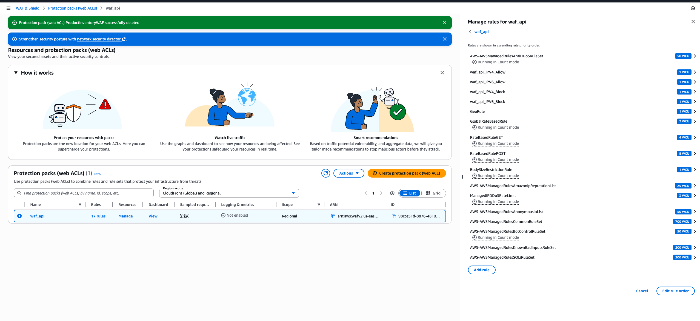


### Step 13: Test the Application

1. Open the **Bucket website endpoint URL** in a browser (from Step 10)
2. The page should load and display all products
3. Test search filters:
   - Filter by category
   - Search by name
   - Filter by price range
   - Combine multiple filters


## Part 2: Monitor your application

In the following steps, you will set up CloudWatch monitoring to gain visibility into your application's health, performance, and errors. This includes creating alarms that notify you when issues occur and building a dashboard to visualize key metrics across all components of your serverless architecture.

### Step 14: Create SNS Topic for Notifications

Before creating alarms, set up an SNS topic to receive alert notifications.

1. Navigate to **SNS Console**
2. Click **Topics** → **Create topic**
3. Configure:
   - **Type**: Standard
   - **Name**: `ProductInventory-Alerts`
4. Click **Create topic**
5. In the topic details, click **Create subscription**
6. Configure:
   - **Protocol**: Email
   - **Endpoint**: Your email address
7. Click **Create subscription**
8. Check your email and **confirm the subscription** by clicking the confirmation link


### Step 15: Create CloudWatch Alarms

Set up alarms to get notified when something goes wrong with your application.

1. Navigate to **CloudWatch Console**
2. Click **Alarms** → **All alarms** → **Create alarm**

**Alarm 1: Lambda Errors**

3. Click **Select metric**
4. Choose **Lambda** → **By Function Name** → `ProductSearchFunction` → `Errors`
5. Click **Select metric**
6. Configure:
   - **Statistic**: Sum
   - **Period**: 5 minutes
   - **Threshold type**: Static
   - **Condition**: Greater than 5
7. Click **Next**
8. Configure actions:
   - **Alarm state trigger**: In alarm
   - **SNS topic**: Select `ProductInventory-Alerts`
9. Click **Next**
10. **Alarm name**: `ProductSearch-Lambda-Errors`
11. Click **Create alarm**


**Alarm 2: API Gateway 5XX Errors**

Repeat the process with:
- **Metric**: API Gateway → By API Name → `ProductInventoryAPI` → `5XXError`
- **Condition**: Greater than 10 in 5 minutes
- **Alarm name**: `ProductInventory-API-5XX-Errors`


**Alarm 3: High Lambda Duration**

Repeat the process with:
- **Metric**: Lambda → By Function Name → `ProductSearchFunction` → `Duration`
- **Statistic**: Average
- **Condition**: Greater than 3000 (milliseconds)
- **Alarm name**: `ProductSearch-High-Duration`


### Step 16: Create CloudWatch Dashboard

Create a centralized dashboard to monitor all components of your application.

1. Navigate to **CloudWatch Console**
2. Click **Dashboards** → **Create dashboard**
3. **Dashboard name**: `ProductInventory-Dashboard`
4. Click **Create dashboard**

**Add Widget 1: Lambda Invocations and Errors**

5. Select **Line** widget → **Next**
6. Select **Metrics** tab
7. Choose **Lambda** → **By Function Name** → `ProductSearchFunction`
8. Select metrics: `Invocations`, `Errors`
9. Click **Create widget**


**Add Widget 2: Lambda Duration**

10. Click **Add widget** → **Line**
11. Choose **Lambda** → **By Function Name** → `ProductSearchFunction`
12. Select metric: `Duration`
13. Click **Create widget**

**Add Widget 3: API Gateway Metrics**

14. Click **Add widget** → **Line**
15. Choose **API Gateway** → **By API Name** → `ProductInventoryAPI`
16. Select metrics: `Count`, `4XXError`, `5XXError`, `Latency`
17. Click **Create widget**


**Add Widget 4: DynamoDB Metrics**

18. Click **Add widget** → **Line**
19. Choose **DynamoDB** → **Table Metrics** → `ProductInventory`
20. Select metrics: `ConsumedReadCapacityUnits`
21. Click **Create widget**


### Step 17: Test Monitoring Setup

1. Generate some traffic to your application by refreshing the S3 website multiple times
2. Try different search filters to create varied API calls
3. Return to your CloudWatch Dashboard and observe the metrics updating
4. Verify your alarms are in **OK** state (green)

To test alarm notifications:
1. Temporarily modify your Lambda function to throw an error
2. Make several API calls to trigger the error
3. Wait for the alarm to enter **In alarm** state
4. Check your email for the SNS notification
5. Revert the Lambda function to its working state

## Part 3: Add POST Method to Create Products from the front end


In this step, you'll extend your REST API to support creating new products through a POST endpoint. This involves modifying multiple components of your architecture to work together:

**What You'll Build:**
- Extend your Lambda function to handle both GET (read) and POST (create) operations
- Add a POST method to your API Gateway that routes create requests to Lambda
- Build a web form in your frontend that allows users to add new products
- Implement validation to ensure data integrity before inserting into DynamoDB

1. **Lambda Function**: You'll replace the existing code with an enhanced version that:
   - Checks the HTTP method (GET or POST) and routes to the appropriate handler
   - Validates all required fields are present (productId, name, category, price, stock, manufacturer)
   - Validates data types (price must be a number, stock must be an integer)
   - Validates business rules (price and stock cannot be negative)
   - Checks for duplicate productId to prevent overwriting existing products
   - Returns appropriate HTTP status codes (201 for success, 400 for validation errors, 409 for duplicates, 500 for server errors)

2. **API Gateway**: You'll add a POST method to the `/products` resource that:
   - Accepts POST requests with JSON body containing product data
   - Uses Lambda Proxy integration to forward the entire request to your Lambda function
   - Enables CORS headers so your S3-hosted website can make cross-origin requests
   - Returns the Lambda response directly to the client

3. **Frontend (index.html)**: You'll add three new sections:
   - **HTML Form**: A user-friendly form with input fields for all product attributes
   - **CSS Styles**: Styling to make the form look professional and provide visual feedback
   - **JavaScript Handler**: Code that captures form submission, sends a POST request to your API, handles success/error responses, and refreshes the product list

**Architecture Flow:**
User fills form → S3 Website → API Gateway POST /products → Lambda validates → DynamoDB insert → Success response

**Part A: Modify Lambda Function**


1. Replace the existing code with the updated version that handles both GET and POST requests:

Your current Lambda function only handles GET requests (searching/listing products). You need to:
1. Add routing logic to handle both GET and POST methods
2. Keep your existing GET logic (just move it to a separate function)
3. Add new POST logic to create products with validation

---

## Step 1: Add Required Import

**What to do:** At the top of your file, add the datetime import.

**Current imports:**
```python
import json
import boto3
import os
from decimal import Decimal
```

**Add this line:**
```python
from datetime import datetime
```

**Your imports should now look like:**
```python
import json
import boto3
import os
from decimal import Decimal
from datetime import datetime
```

---

## Step 2: Modify lambda_handler to Route by HTTP Method

**What to do:** Replace your entire `lambda_handler` function with this routing logic:

```python
def lambda_handler(event, context):
    """Main entry point - routes requests based on HTTP method"""
    print(f"Received event: {json.dumps(event)}")
    
    # Extract the HTTP method from the event
    http_method = event.get('httpMethod', '')
    
    # Route to appropriate handler based on HTTP method
    if http_method == 'GET':
        return handle_get_request(event)
    elif http_method == 'POST':
        return handle_post_request(event)
    else:
        # Return 405 Method Not Allowed for unsupported methods
        return {
            'statusCode': 405,
            'headers': {
                'Access-Control-Allow-Origin': '*',
                'Content-Type': 'application/json'
            },
            'body': json.dumps({'error': 'Method not allowed'})
        }
```

**Why:** API Gateway passes the HTTP method in the event. By checking it, you can handle GET and POST differently.

---

## Step 3: Move Existing Logic to handle_get_request()

**What to do:** Create a new function called `handle_get_request(event)` and copy ALL your current logic into it.

**Complete function:**

```python
def handle_get_request(event):
    """Handle GET requests to search/list products"""
    
    # CORS headers - Allow web browsers to call this API from different domains
    headers = {
        'Access-Control-Allow-Origin': '*',
        'Access-Control-Allow-Headers': 'Content-Type',
        'Access-Control-Allow-Methods': 'GET, POST, OPTIONS'
    }
    
    try:
        # Handle CORS preflight request
        if event.get('httpMethod') == 'OPTIONS':
            return {
                'statusCode': 200,
                'headers': headers,
                'body': json.dumps({'message': 'CORS preflight'})
            }
        
        # Extract query parameters from API Gateway event
        query_params = event.get('queryStringParameters', {}) or {}
        
        # Initialize scan parameters with table name
        scan_params = {'TableName': table_name}
        
        # Build filter expression if query parameters exist
        if query_params:
            filter_expressions = []
            expression_attribute_values = {}
            expression_attribute_names = {}
            
            # Filter by category (exact match)
            if 'category' in query_params:
                filter_expressions.append('#cat = :category')
                expression_attribute_names['#cat'] = 'category'
                expression_attribute_values[':category'] = {'S': query_params['category']}
            
            # Filter by name (partial match using contains)
            if 'name' in query_params:
                filter_expressions.append('contains(#name, :name)')
                expression_attribute_names['#name'] = 'name'
                expression_attribute_values[':name'] = {'S': query_params['name']}
            
            # Filter by minimum price
            if 'minPrice' in query_params:
                filter_expressions.append('#price >= :minPrice')
                expression_attribute_names['#price'] = 'price'
                expression_attribute_values[':minPrice'] = {'N': query_params['minPrice']}
            
            # Filter by maximum price
            if 'maxPrice' in query_params:
                filter_expressions.append('#price <= :maxPrice')
                expression_attribute_names['#price'] = 'price'
                expression_attribute_values[':maxPrice'] = {'N': query_params['maxPrice']}
            
            # Add filter expression to scan parameters if filters exist
            if filter_expressions:
                scan_params['FilterExpression'] = ' AND '.join(filter_expressions)
                scan_params['ExpressionAttributeValues'] = expression_attribute_values
                scan_params['ExpressionAttributeNames'] = expression_attribute_names
        
        # Execute scan operation on DynamoDB table
        response = dynamodb.scan(**scan_params)
        
        # Convert DynamoDB format to simple JSON
        items = []
        for item in response.get('Items', []):
            converted_item = {}
            for key, value in item.items():
                if 'S' in value:  # String type
                    converted_item[key] = value['S']
                elif 'N' in value:  # Number type
                    converted_item[key] = float(value['N'])
            items.append(converted_item)
        
        # Return successful response with products
        return {
            'statusCode': 200,
            'headers': headers,
            'body': json.dumps({
                'count': len(items),
                'products': items
            })
        }
        
    except Exception as e:
        # Log error and return error response
        print(f"Error in GET: {str(e)}")
        return {
            'statusCode': 500,
            'headers': headers,
            'body': json.dumps({'error': str(e)})
        }
```

**Important:** This is your existing logic - just wrapped in a function. The logic hasn't changed.

---

## Step 4: Create handle_post_request() Function

**What to do:** Add this completely new function to handle creating products:

```python
def handle_post_request(event):
    """Handle POST requests to create new products"""
    
    # Define CORS headers (same as GET)
    headers = {
        'Access-Control-Allow-Origin': '*',
        'Access-Control-Allow-Headers': 'Content-Type',
        'Access-Control-Allow-Methods': 'GET, POST, OPTIONS'
    }
    
    try:
        # Step 1: Parse the JSON body from the request
        # API Gateway passes the body as a string, so we need to parse it
        body = json.loads(event.get('body', '{}'))
        
        # Step 2: Validate required fields
        # Define all required fields for a product
        required_fields = ['productId', 'name', 'category', 'price', 'stock', 'manufacturer']
        
        # Check which fields are missing
        missing_fields = []
        for field in required_fields:
            if field not in body:
                missing_fields.append(field)
        
        # If any fields are missing, return error
        if missing_fields:
            return {
                'statusCode': 400,
                'headers': headers,
                'body': json.dumps({
                    'error': 'Missing required fields',
                    'missing': missing_fields
                })
            }
        
        # Step 3: Validate data types and business rules
        try:
            # Convert price to float, then check if it's valid
            price = float(body['price'])
            if price < 0:
                raise ValueError("Price cannot be negative")
            
            # Convert stock to integer, then check if it's valid
            stock = int(body['stock'])
            if stock < 0:
                raise ValueError("Stock cannot be negative")
                
        except (ValueError, TypeError) as e:
            # If conversion fails or validation fails, return error
            return {
                'statusCode': 400,
                'headers': headers,
                'body': json.dumps({
                    'error': 'Invalid data types or values',
                    'details': str(e)
                })
            }
        
        # Step 4: Check if product already exists
        try:
            existing_item = dynamodb.get_item(
                TableName=table_name,
                Key={'productId': {'S': body['productId']}}
            )
            
            # If 'Item' key exists in response, the product already exists
            if 'Item' in existing_item:
                return {
                    'statusCode': 409,  # 409 = Conflict
                    'headers': headers,
                    'body': json.dumps({
                        'error': 'Product already exists',
                        'productId': body['productId']
                    })
                }
        except Exception as e:
            # Log error but continue (don't fail the request if check fails)
            print(f"Error checking existing product: {str(e)}")
        
        # Step 5: Prepare the item in DynamoDB format
        # DynamoDB requires format: {'attributeName': {'S': 'string value'}} or {'attributeName': {'N': 'number as string'}}
        item = {
            'productId': {'S': body['productId']},
            'name': {'S': body['name']},
            'category': {'S': body['category']},
            'price': {'N': str(price)},  # Numbers must be strings in DynamoDB format
            'stock': {'N': str(stock)},
            'manufacturer': {'S': body['manufacturer']},
            'lastUpdated': {'S': datetime.now().strftime('%Y-%m-%d')}
        }
        
        # Step 6: Insert into DynamoDB
        dynamodb.put_item(
            TableName=table_name,
            Item=item
        )
        
        print(f"Successfully created product: {body['productId']}")
        
        # Step 7: Convert the item back to simple format for the response
        response_item = {
            'productId': body['productId'],
            'name': body['name'],
            'category': body['category'],
            'price': price,
            'stock': stock,
            'manufacturer': body['manufacturer'],
            'lastUpdated': datetime.now().strftime('%Y-%m-%d')
        }
        
        # Step 8: Return success response
        return {
            'statusCode': 201,  # 201 = Created
            'headers': headers,
            'body': json.dumps({
                'message': 'Product created successfully',
                'product': response_item
            })
        }
        
    except json.JSONDecodeError:
        # If the body is not valid JSON, return 400 Bad Request
        return {
            'statusCode': 400,
            'headers': headers,
            'body': json.dumps({'error': 'Invalid JSON in request body'})
        }
    
    except Exception as e:
        # Catch any other unexpected errors
        print(f"Error in POST: {str(e)}")
        return {
            'statusCode': 500,
            'headers': headers,
            'body': json.dumps({'error': str(e)})
        }
```

**What this function does:**

1. **Parses the request body** - Converts JSON string to Python dictionary
2. **Validates required fields** - Checks all 6 required fields are present
3. **Validates data types** - Ensures price is a number and stock is an integer, both non-negative
4. **Checks for duplicates** - Queries DynamoDB to see if productId already exists
5. **Prepares DynamoDB item** - Converts to DynamoDB's special format
6. **Inserts the item** - Calls put_item to store in DynamoDB
7. **Returns success** - Sends back 201 status with the created product

---

## Complete File Structure

Your complete `lambda_function.py` should now look like this:

```python
# Imports
import json
import boto3
import os
from decimal import Decimal
from datetime import datetime

# Initialize DynamoDB client
dynamodb = boto3.client('dynamodb')
table_name = os.environ.get('TABLE_NAME', 'ProductInventory')

# Main handler - routes by HTTP method
def lambda_handler(event, context):
    # ... (routing code from Step 2) ...

# GET handler - your existing search logic
def handle_get_request(event):
    # ... (complete code from Step 3) ...

# POST handler - new create logic
def handle_post_request(event):
    # ... (complete code from Step 4) ...
```
Test the Lambda before moving to modify the API gateway

```
{
  "httpMethod": "POST",
  "body": "{\"productId\": \"PROD999\",\"name\": \"Test Product\",\"category\": \"Testing\",\"price\": 99.99,\"stock\": 50,\"manufacturer\": \"TestCorp\"}",
  "headers": {
    "Content-Type": "application/json"
  },
  "queryStringParameters": null,
  "pathParameters": null,
  "requestContext": {
    "httpMethod": "POST"
  }
}
```

### Part B: Add POST Method to API Gateway

Now you need to configure API Gateway to accept POST requests and route them to your Lambda function

Important: once the method is created you need to enable CORS for the POST method

After deployed, your API URL remains the same. The same endpoint now handles both GET and POST requests

Now you can test the method in API Gateway and verify that is included in the DynamoDB

Paste this JSON test data:
```
{
  "productId": "PROD999",
  "name": "Test Product",
  "category": "Testing",
  "price": 99.99,
  "stock": 50,
  "manufacturer": "TestCorp"
}

```

### Part C: Update Frontend to Add Products

Now you'll modify your HTML file to add a form that lets users create products through your new API.

On your local computer, open your 'index.html' file in a text editor 

**Add the HTML Form**

Find the line that contains `<div class="products" id="products">` (this is where products are displayed) **Above that line**, add the following HTML code:

```html
<!-- Add New Product Form -->
<div class="add-product-section">
    <h2>Add New Product</h2>
    <form id="addProductForm">
        <div class="form-row">
            <div class="form-group">
                <label for="productId">Product ID *</label>
                <input type="text" id="productId" required placeholder="e.g., PROD100">
            </div>
            <div class="form-group">
                <label for="productName">Product Name *</label>
                <input type="text" id="productName" required placeholder="e.g., Hydraulic Press">
            </div>
        </div>
        
        <div class="form-row">
            <div class="form-group">
                <label for="category">Category *</label>
                <input type="text" id="category" required placeholder="e.g., Machinery">
            </div>
            <div class="form-group">
                <label for="manufacturer">Manufacturer *</label>
                <input type="text" id="manufacturer" required placeholder="e.g., ToolCorp">
            </div>
        </div>
        
        <div class="form-row">
            <div class="form-group">
                <label for="price">Price ($) *</label>
                <input type="number" id="price" step="0.01" min="0" required placeholder="0.00">
            </div>
            <div class="form-group">
                <label for="stock">Stock *</label>
                <input type="number" id="stock" min="0" required placeholder="0">
            </div>
        </div>
        
        <button type="submit" class="btn-add">Add Product</button>
        <div id="addProductMessage"></div>
    </form>
</div>
```
Find the `<style>` section in your HTML (near the top, inside the `<head>` tag) **At the end of the style section** (before the closing `</style>` tag), add this CSS:

```css
/* Add Product Form Styles */
.add-product-section {
    background: white;
    padding: 20px;
    border-radius: 8px;
    box-shadow: 0 2px 4px rgba(0,0,0,0.1);
    margin-bottom: 30px;
}

.add-product-section h2 {
    margin-top: 0;
    color: #333;
}

.form-row {
    display: grid;
    grid-template-columns: 1fr 1fr;
    gap: 15px;
    margin-bottom: 15px;
}

.form-group {
    display: flex;
    flex-direction: column;
}

.form-group label {
    margin-bottom: 5px;
    font-weight: 600;
    color: #555;
}

.form-group input {
    padding: 10px;
    border: 1px solid #ddd;
    border-radius: 4px;
    font-size: 14px;
}

.form-group input:focus {
    outline: none;
    border-color: #007bff;
}

.btn-add {
    background-color: #28a745;
    color: white;
    padding: 12px 30px;
    border: none;
    border-radius: 4px;
    cursor: pointer;
    font-size: 16px;
    font-weight: 600;
}

.btn-add:hover {
    background-color: #218838;
}

.btn-add:disabled {
    background-color: #6c757d;
    cursor: not-allowed;
}

#addProductMessage {
    margin-top: 15px;
    padding: 10px;
    border-radius: 4px;
    display: none;
}

#addProductMessage.success {
    background-color: #d4edda;
    color: #155724;
    border: 1px solid #c3e6cb;
    display: block;
}

#addProductMessage.error {
    background-color: #f8d7da;
    color: #721c24;
    border: 1px solid #f5c6cb;
    display: block;
}
```

**Add JavaScript Handler**

Find the `<script>` section in your HTML (near the bottom, before the closing `</body>` tag) **At the end of the script section** (before the closing `</script>` tag), add this JavaScript:

```javascript
// Handle add product form submission
document.getElementById('addProductForm').addEventListener('submit', async (e) => {
    e.preventDefault();
    
    const messageDiv = document.getElementById('addProductMessage');
    const submitButton = e.target.querySelector('button[type="submit"]');
    
    // Disable submit button to prevent double submission
    submitButton.disabled = true;
    submitButton.textContent = 'Adding...';
    
    // Collect form data
    const productData = {
        productId: document.getElementById('productId').value.trim(),
        name: document.getElementById('productName').value.trim(),
        category: document.getElementById('category').value.trim(),
        manufacturer: document.getElementById('manufacturer').value.trim(),
        price: parseFloat(document.getElementById('price').value),
        stock: parseInt(document.getElementById('stock').value)
    };
    
    try {
        // Send POST request to API
        const response = await fetch(API_URL, {
            method: 'POST',
            headers: {
                'Content-Type': 'application/json'
            },
            body: JSON.stringify(productData)
        });
        
        const data = await response.json();
        
        if (response.ok) {
            // Success - show success message
            messageDiv.className = 'success';
            messageDiv.textContent = `✓ Product "${productData.name}" added successfully!`;
            messageDiv.style.display = 'block';
            
            // Reset form
            document.getElementById('addProductForm').reset();
            
            // Refresh product list to show new product
            loadProducts();
            
            // Hide message after 5 seconds
            setTimeout(() => {
                messageDiv.style.display = 'none';
            }, 5000);
        } else {
            // Error from API - show error message
            messageDiv.className = 'error';
            messageDiv.textContent = `✗ Error: ${data.error || 'Failed to add product'}`;
            if (data.details) {
                messageDiv.textContent += ` - ${data.details}`;
            }
            if (data.missing) {
                messageDiv.textContent += ` (${data.missing.join(', ')})`;
            }
            messageDiv.style.display = 'block';
        }
    } catch (error) {
        // Network or other error
        messageDiv.className = 'error';
        messageDiv.textContent = `✗ Network Error: ${error.message}`;
        messageDiv.style.display = 'block';
    } finally {
        // Re-enable submit button
        submitButton.disabled = false;
        submitButton.textContent = 'Add Product';
    }
});
```

 **Save** your `index.html` file

Finally, you can update the file in S3 and test it.


## Flow


```
┌─────────┐      ┌─────────────┐      ┌──────────────┐      ┌────────┐      ┌──────────┐
│  User   │─────▶│  S3 Static  │─────▶│ API Gateway  │─────▶│ Lambda │─────▶│ DynamoDB │
│ Browser │      │   Website   │      │  (REST API)  │      │Function│      │  Table   │
└─────────┘      └─────────────┘      └──────────────┘      └────────┘      └──────────┘
                                              │                    │
                                              │                    │
                                              ▼                    ▼
                                       ┌──────────────────────────────┐
                                       │   CloudWatch Logs & Metrics  │
                                       └──────────────────────────────┘
```


## Resources

- [AWS VPC Documentation](https://docs.aws.amazon.com/vpc/)
- [Amazon DynamoDB Documentation](https://docs.aws.amazon.com/dynamodb/)
- [Amazon API gateway Documentation](https://docs.aws.amazon.com/apigateway/latest/developerguide/welcome.html)
- [Web hosting in Amazon S3](https://docs.aws.amazon.com/AmazonS3/latest/userguide/WebsiteHosting.html)
- [CloudWatch Documentation](https://docs.aws.amazon.com/cloudwatch/)


## Submission

You will need to create one lab report. At the bare minimum, it should include:
1. Names and student number
2. Screenshots of your DynamoDB with the items
3. Screenshot of VPC endpoint
4. Screenshot of Lambda working with a test
5. Screenshot of API Gateway methods (both GET and POST)
6. Screenshot of S3 static website and data access test
7. Screenshot of WAF Web ACL with enabled rules
8. Screenshot of CloudWatch Dashboard showing metrics from all services
9. Screenshot of POST method test in API Gateway showing successful product creation (status 201)
10. Screenshot of DynamoDB table showing the product created via POST request
11. Screenshot of the web form with "Add New Product" section visible
12. Screenshot showing successful product addition with green success message in the browser
13. Explain key concepts learned during the lab.
14. Explain problems you ran into and how you were able to solve them.
15. Answer to the following questions:
   - What is the purpose of a VPC Endpoint for DynamoDB, and why did we use it instead of a NAT Gateway? What are the cost and security benefits?
   - Why did we place the Lambda function inside a VPC? What are the trade-offs of running Lambda in a VPC versus outside a VPC?
   - What is the purpose of API Gateway in this architecture? Explain how it connects the S3 static website to the Lambda function and what benefits it provides.
   - Explain the purpose of AWS WAF and describe at least two types of attacks that the managed rule groups we enabled (Core rule set, Known bad inputs, SQL database) can protect against.
   - Explain the difference between PUT and POST HTTP methods. Why did we use POST for creating products in this lab? 


Delete the WAF Web ACL after completing the lab to avoid ongoing charges.


   


   
